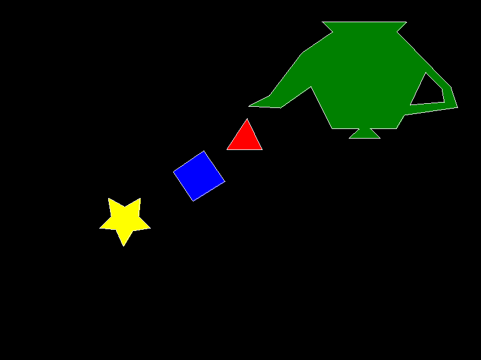

# Laboratorio: Relleno de Polígonos

Este proyecto implementa un algoritmo para rellenar polígonos con más de 4 vértices utilizando la librería [raylib](https://www.raylib.com/) en Rust.

## Estructura

El código está organizado en 5 ramas principales:

- **Poligon-1**: Polígono amarillo con borde blanco
- **Poligon-2**: Polígono azul con borde blanco
- **Poligon-3**: Polígono rojo con borde blanco
- **Poligon-4**: Polígono verde con borde blanco y un agujero (Polígono 5)
- **Final-Entrega**: Todos los polígonos unidos y el archivo .png 

Cada rama contiene su propia versión del archivo `out.bmp` generado por el algoritmo.

## Resultado final



## Requisitos

- Rust 1.88+
- CMake instalado
- Librería `raylib` como dependencia (agregada vía Cargo)

## Cómo correr

```bash
cargo run
```

## Contacto

- **Estudiante:** Fernando Rueda  
- **Carnet:** 23748  
- **Email:** rue3748@uvg.edu.gt


